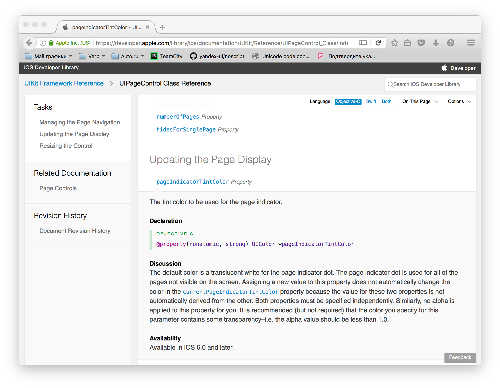

---

layout: default

style: |

    .react-native-runtime {
        width: 90%
    }
    
    .navigator-img {
        height: 640px;
        left: -240px !important;
    }
    
    .navigator h3 {
        color: #FFF;
        font-size: 60px;
        font-weight: bold;
        top: 230px;
        position: relative;
    }
    
    .NavigationExperimental blockquote p {
        line-height: 65px  !important;
    }
    
    .NavigationExperimental blockquote {
        top: 40% !important;
    }
 
---

# Яндекс

## **{{ site.presentation.title }}** {#cover}

    
{{ site.presentation.service }}





	
{{ site.author.name }},   {{ site.author.position }}

## &nbsp;
{:.section}

### React Native

## &nbsp;
{:.section}

### React + Native

## React Native

### React Native &mdash; фреймворк для разработки кроссплатформенных приложений для iOS и Android

* Появился в начале 2015 года
* Построен на базе React
* Не использует WebView и HTML-технологии
* Нативные компоненты имеют биндинги в JS и обернуты в React
* Поддержка iOS лучше, чем Android

## Первый ли он? Нет!

* <b>PhoneGap</b> &mdash; реализация стардантных компонент с помощью веб-технологий. Запускается в WebView.
* <b>Xamarin</b> &mdash; от разработчиков Mono для Linux. Приложения написаны на&nbsp;С#. 
* <b>NativeScript</b> &mdash; похожие идеи, что и в RN. XML + JS + CSS.

## Одного JS мало

### Инструменты разработчика

* Ваш любимый редактор JS
* XCode и <strike>100$</strike> Developet account 
* Терпение + Android Studio + SDK + Эмулятор (если собирать сам React&nbsp;Native, то еще NDK). <i>Тот еще процесс</i> 

## React Native: взгляд сверху

* Релизы примерно раз в 2 недели.
* Все прелести early adopters: несовместимые изменения, регулярные проблемы обновления. 
* Все тот же обычный React.

## React Native: взгляд изнутри

* нет HTML, но есть компоненты платформы в JSX.
* {:.next}нет CSS, но есть CSS-like полифилы.
* {:.next}нет DOM API. Вообще. Совсем.
* {:.next}ES6/ES7 и всё, что может babel, но нет JIT (на iOS).

## &nbsp;
{:.section}

### Что же такое React Native?

## &nbsp;
{:.section}

### React Native!  Write once, run everywhere!

## &nbsp;
{:.section}

### React Native?  Write once, run everywhere?

## &nbsp;
{:.section}

### React Native.  <strike>Write once, run everywhere</strike>

## &nbsp;
{:.section}

### React Native.  Learn once, write everywhere.

## Немного философии

Все нативно, поэтому <b>забудьте про полную кроссплатформенность</b>.

<b>Платформы разные</b>, поэтому и <b>компоненты разные</b>. У них разная логика и механика взаимодействия. &nbsp;

Можно писать все на JS и выкинуть понятие native, но вы этого не хотите :) &nbsp;

<b>Native &mdash; это ваще преимущество!</b>

## iOS
{:.center}

{:style="width:95%"}

## Android
{:.center}

{:style="width:85%"}

## Кроссплатформенность

* {:.next}Интерактивные компоненты (навигация, меню, ...) будут разные
* {:.next}Из-за этого раскладка приложения скорее всего будет разной
* {:.next}Логические компоненты приложения будут одинаковые

## &nbsp;
{:.section}

### Пишем приложение

## Что у нас есть

* Нет привычных <code>div</code>, <code>span</code>, <code>button</code>, <code>input</code> и т.п.
* Нет привычного CSS
* Нет DOM

## Компоненты

### Приложение строится из компонент платформы &mdash; это нативные модули завернутые в React-компоненты

* Есть кроссплатформенные: <code>View</code>, <code>Text</code>, <code>Image</code>, <code>Picker</code>, ...
* Есть специфичные для iOS: <code>TabBarIOS</code>, <code>ActionSheetIOS</code>, ...
* Есть специфичные для Android: <code>BackAndroid</code>, <code>ToolbarAndroid</code>, ...

## Пример #render()

~~~ jsx
render() {
    return (
        <View style={styles.container}>
            <TouchableOpacity onPress={this.props.onPress}>
                <Image source={require('../icons/close.png')}
                    resizeMode="cover"/>
            </TouchableOpacity>
            <Text style={styles.placeText} numberOfLines={1}>
                {myText.join(', ')}
            </Text>
            <ScrollView keyboardDismissMode="on-drag"
                refreshControl={<RefreshControl/>}/>
                {this.props.children}
            </ScrollView>
        </View>
    );
}
~~~

## Пример #render()

~~~ jsx
render() {
    return (
        <View style={styles.container}>
            <TextInput
                autoCapitalize="sentences"
                keyboardType="email-address"
                maxLength={500}
                multiline={true}
                placeholder="Введите комменатрий..."
                style={styles.myInput}
                onSelectionChange={this._onSelectionChange}
                onSubmitEditing={this._onSubmitEditing}
                onChangeText={this._onChangeText}
                textProcessor={this._textProcessor}
            />
        </View>
    );
}
~~~

## CSS

### CSS не настоящий &mdash; это полифил.

* Верстка абсолютными значениями. Никаких относительных величин.
* Для раскладки есть ограниченная реализация flexbox-свойств.
* Полной поддержки CSSx никогда не будет. Она не нужна.
* Всего реализовано около 70-и свойств.

## Пример CSS

~~~ javascript
const styles = StyleSheet.create({
    default: {
        fontSize: PixelRatio.getPixelSizeForLayoutSize(7),
        color: 'rgba(0, 0, 0, 0.60)'
    },
    
    suggestUser: {
        height: PixelRatio.getPixelSizeForLayoutSize(100),
    
        backgroundColor: '#FFF',
        shadowColor: '#000',
        shadowOffset: {
            height: -5
        },
        shadowRadius: 5,
        shadowOpacity: 0.5
    }
};
~~~

## Пример CSS

~~~ javascript
const styles = StyleSheet.create({
    container: {
        flex: 1, 
        flexDirection: 'row',

        paddingHorizontal: PixelRatio.getPixelSizeForLayoutSize(4),
        marginVertical: PixelRatio.getPixelSizeForLayoutSize(7),

        borderTopWidth: PixelRatio.getPixelSizeForLayoutSize(0.5),
        borderTopColor: 'rgba(0, 0, 0, 0.10)'
    },

    button: {
        alignItems: 'center',
        justifyContent: 'center',
        paddingLeft: PixelRatio.getPixelSizeForLayoutSize(7)
    },
};
~~~

## Болванка приложения

* Подключайте redux/flux. Без них будет совсем плохо.
* Продумайте свои экраны и логику переходов.
* Будут различия для iOS и Android.
* Главным компонентом будет <code>Navigator</code>

## Болванка приложения

~~~ jsx
class MyApp extends React.Component {
    render() {
        return (
            <View style={styles.main}>
                <StatusBar animated={true} barStyle="default"/>
                <Navigator
                    initialRoute={INITIAL_ROUTE}
                    renderScene={this.renderScene}
                    sceneStyle={styles.scene}
                    navigationBar={<NavigationBar {...this.props}/>}
                />
            </View>
        );
    }
}
AppRegistry.registerComponent('MyApp', () => MyApp);
~~~

## Навигация

* {:.next}Eсть специфичные компоненты (<code>TabBarIOS</code>, <code>ToolbarAndroid</code>). 
* {:.next}Высокоуровневая навигация будет разной. 
* {:.next}Надо сразу продумать взимодействие с <code>Navigator</code> (например, redux).
* {:.next}После нескольких страниц, вы начнете испытывать боль.

## &nbsp;
{:.section}

### Боль и ужас Navigator

## Navigator

Имеет ряд проблем:

* Императивное API (методы) для управления. 
* Анимации и жесты сложно управляемы. 
* <code>NavigatorBar</code> совсем отвязан от общей жизни.

Во многом, проблемы решаются с помощью redux.

## Буэээ, Navigator

~~~ jsx
class MyApp extends React.Component {
    render() {
        return (
            <Navigator
                ref="MyNav"
                renderScene={this.renderScene}
            />
        );
    }
    
    componentDidMount() {
        this.refs.MyNav.push({id: 'new-route'})
    }
}
~~~

## NavigatorBar или зачем нужен redux
{:.center}

{:style="height:640px"}

## NavigatorBar или зачем нужен redux
{:.center}

## NavigatorBar или зачем нужен redux

* Не стоит пытаться связать <code>MyComponent</code> и <code>NavigationBar</code>.
* Лучше использовать global state и dispatch actions (flux/redux).

## NavigatorBar или зачем нужен redux
{:.center}

## NavigationExperimental

В декабре 2015 [Eric Vicenti](https://github.com/ericvicenti) организовал проект [navigation-rfc](https://github.com/ericvicenti/navigation-rfc),
где, с помощью сообщества, попытался решить проблемы Navigator. &nbsp;

В феврале проект переехал в мастер React Native под название NavigationExperimental
и теперь развивается силами Facebook.  &nbsp;

Navigation больше будет развиваться и поддерживаться.

## NavigationExperimental

Что сделано:

* Состоянием управляется через reducer.
* Вместо императивного API - action. 
* Логика навигации отделяется от представления.
* Разделение NavigationBar, анимаций и жестов управления на различные компоненты. 

## NavigationExperimental
~~~ jsx
<NavigationExperimental.RootContainer

  // Outputs the new nav state for a previous state and action
  reducer={GameReducer}

  // Render the application as a function of navigation state:
  renderNavigation{(state, onNavigate) => (
    <GameBoard
      game={state}
      onTurn={(row, col) => {
        onNavigate({ type: 'TURN', row, col });
      }}
      onReset{() => {
        onNavigate({ type: 'RESET' });
      }}
    />
  )}
/>
~~~

## &nbsp;
{:.with-big-quote.NavigationExperimental}
> For most non-trivial apps, you will want to use NavigationExperimental - it won't be long before you run into issues when trying to do anything complex with Navigator

Eric Vicenti
{:.note}

## &nbsp;
{:.section}

### Анимации

## &nbsp;
{:.section}

### CSS Transition?

## &nbsp;
{:.section}

### <strike>CSS Transition</strike>

## &nbsp;
{:.section}

### CSS Animation?

## &nbsp;
{:.section}

### <strike>CSS Animation</strike>

## &nbsp;
{:.section}

### &lt;Animated/>!

## Анимации

* Реализуются через специальный компонент <code>Animated</code>
* Есть <code>&lt;Animated.View></code>, <code>&lt;Animated.Image></code>, <code>&lt;Animated.Text></code>
* Работают вне React, напрямую обновляя нативные компоненты.

## Анимации
{:.big-code}
~~~ jsx
class MyComponent extends React.Component {
    constructor(props) {
        super(props);
        this.state = {
            bounceValue: new Animated.Value(0)
        };
    }
    
    componentDidMount() {
        this.state.bounceValue.setValue(1.5);
    }
    
    
    render() {
        return (
            <Animated.Image source={...} 
                style={
                    {transform: [
                        {scale: this.state.bounceValue}
                    ]}
                }
                />
        );
    }
}
~~~

## &nbsp;
{:.section}

### Нативные модули

## Нативные модули

React Native реализует основные, но не все.
 
Если модуля нет:

* Попробовать найти что-то подобное в UIExplorer.
* Найти правильное название модуля в терминах OS.
* Поискать в исходных текстах, возмжно он недокументирован.
* [js.coach/react-native](https://js.coach/react-native)
* Отдавайте предпочтение нативной реализации, а не на JS.

## Нативные модули - как подключить

Есть инструкция для [iOS](http://facebook.github.io/react-native/docs/linking-libraries-ios.html), для Anroid нет.
В плагине, скорее всего, будет инструкция. &nbsp;

Забудьте про это! Используйте [rnpm](https://github.com/rnpm/rnpm) - React Native package manager.

## &nbsp;
{:.section}

### Кроссплатформенность компонент

## Неправильный путь

Разложить все по папкам

* common/components
* android/components
* ios/components

и подключать их в зависимости от платформы

## Правильный путь

Разложить все по папкам

* MyComponent/Component.ios.js, MyComponent/Components.android.js
* ComponentIOS, ComponentAndroid

Для платформо-зависимых компонент (ComponentIOS, ComponentAndroid) удобно класть рядом пустышку,
и не испытывать проблем, что какой-то компонент не найден на платформе. 

## &nbsp;
{:.section}

### Как написать нативный компонент

## Как написать нативный компонент

### Не надо писать все на JS!!1

* У компонента должна быть реализация в [UIKit](https://developer.apple.com/library/ios/documentation/UserExperience/Conceptual/MobileHIG/index.html#//apple_ref/doc/uid/TP40006556-CH66-SW1)
или [Android API](https://www.google.com/design/spec/material-design/introduction.html)
* Если ее нет, вы, скорее всего, хотите странного

## &nbsp;
{:.section}

### Пиcать компоненты просто!

## &nbsp;
{:.section}

### Подключаем UIPageControl

## Ищем описание в UIKit
{:.center}

{:style="height:640px"}

## Описываем свойства в Objective-C

~~~objectivec
#import "RCTPageControlManager.h"
#import "UIKit/UIKit.h"

@implementation RCTPageControlManager

RCT_EXPORT_MODULE()

- (UIView *)view {
  return [UIPageControl new];
}

RCT_EXPORT_VIEW_PROPERTY(currentPage, NSInteger)
RCT_EXPORT_VIEW_PROPERTY(numberOfPages, NSInteger)
RCT_EXPORT_VIEW_PROPERTY(hidesForSinglePage, BOOL)
RCT_EXPORT_VIEW_PROPERTY(pageIndicatorTintColor, UIColor)
RCT_EXPORT_VIEW_PROPERTY(currentPageIndicatorTintColor, UIColor)

RCT_EXPORT_VIEW_PROPERTY(onChange, RCTBubblingEventBlock)
~~~

## Делаем React.Component
 
~~~jsx
class PageControlIOS extends Component {
    render() {
        return (
            <RCTPageControl {...this.props}/>
        );
    }
}

const RCTPageControl = requireNativeComponent(
    'RCTPageControl',
    PageControlIOS
);
    
module.exports = PageControlIOS;

~~~
 
## Это все, что надо сделать!

* Никакой сложности
* Мало кода
* Пример готового нативного компонента [react-native-pagecontrol](https://github.com/doochik/react-native-pagecontrol)

## Что не надо делать?

### <b>Не надо писать всё на JS!!1</b>

## Антипримеры

### GestureRecognizer:
 
* Реализация на JS - это сотни строк забористого кода и баги.
* Подключение нативного распознования жестов занимает 50 строк.
* Нативное распознование всегда работает так, как ожидает пользователь.

## Антипримеры

### Social API (FB, TW, VK):
 
* Подключается легко. Есть готовые компоненты для FB и VK.
* Нативный SDK умеет на порядок больше, чем JS API.

## Полезные ресуры

* Сайт [React Native](http://facebook.github.io/react-native/)
* Поиск компонент [js.coach/react-native](https://js.coach/react-native)
* Статьи и публикации на [www.reactnative.com](http://www.reactnative.com/)
* Сборник статей [github.com/jondot/awesome-react-native](https://github.com/jondot/awesome-react-native)

## Полезные ресуры

iOS

* [Human Interface Guide](https://developer.apple.com/library/ios/documentation/UserExperience/Conceptual/MobileHIG/ )
* [UIKit API](https://developer.apple.com/library/ios/navigation/#section=Frameworks&topic=UIKit)

Android

* [Material Design](https://www.google.com/design/spec/material-design/introduction.html)
* [Android API](http://developer.android.com/guide/index.html)

## **Контакты** {#contacts}

{{ site.author.name }}

{{ site.author.position }}

    

        
doochik@ya.ru

        
@doochik

    

## Как обновлять React Native

Привет, early adopter!

* Обновлять стоит сразу после выхода релиза. Чем больше тянете, тем больше будете страдать.
* Есть <code>react-native upgrade</code>. Сносит все подключенные сторонние модули. Будьте аккуратны.
* Facebook используется определенные версии XCode, GCC, Android SDK. Если вы боитесь проблем, то лучше жить с ними.

## &nbsp;
{:.section}

### И как это работает?

## Как работает React Native

Есть прекрасная статья [Bridging in React Native](http://tadeuzagallo.com/blog/react-native-bridge/) от Tadeu Zagallo.

Если вкратце, то есть три потока:

* shadow queue - тут рисуется layout
* main thread - поток для работы UIKit
* JavaScript thread - поток работы JS

Каждый нативный компонент имеет свою собственную [GCD Queue](https://developer.apple.com/library/ios/documentation/General/Conceptual/ConcurrencyProgrammingGuide/OperationQueues/OperationQueues.htm),
если не указал обратного.

## Runtime startup

* {:.next}Собирает информацию об экспортируемых модулях, методах и их типах
* {:.next}Запускает JavaScriptCore
* {:.next}Экспортирует конфигурацию модулей, как глобальный JSON-объект
* {:.next}Запускает JS приложения

## Runtime bridge startup
{:.center}

{:.react-native-runtime}

## Runtime call cycle

* {:.next}Собирает все вызовы нативного кода за event loop
* {:.next}Вызовы преобразуеются в JSON
* {:.next}Отправляет вызовы пачкой в мост JS<->Native, получает вернувшиеся callback.

## Runtime call cycle
{:.center}

{:.react-native-runtime}

## Runtime call cycle

* {:.next}Компоненты не могут быть синхронными
* {:.next}Могут экспортировать константы и методы с callback/promise
* {:.next}Строгая типизация данных

## {:.navigator-img}
{:.cover.navigator}

### Боль и ужас Navigator
